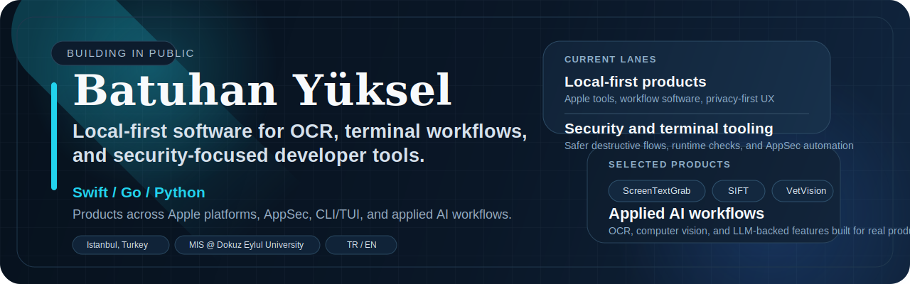

  <picture>
    <source media="(prefers-color-scheme: dark)" srcset="./assets/profile-header-dark.svg">
    <source media="(prefers-color-scheme: light)" srcset="./assets/profile-header-light.svg">
    
  </picture>

  
  

  Istanbul, Turkey / MIS @ Dokuz Eylul University / Turkish and English

  I build software that feels practical on day one: local-first products, safe-by-default terminal tooling,
  and AI-assisted workflows that solve concrete problems.

  <code>local-first products</code>
  <code>OCR workflows</code>
  <code>security tooling</code>
  <code>CLI / TUI</code>
  <code>applied AI</code>

  Privacy-conscious software, reliable terminal UX, and product-ready machine intelligence.

## Focus

- <strong>Local-first products</strong>: privacy-respecting tools for Apple and desktop workflows
- <strong>Security and terminal tooling</strong>: review-first CLI/TUI products with explicit permissions and safer destructive flows
- <strong>Applied AI</strong>: OCR, computer vision, and LLM-assisted workflows built around practical product use cases

## Selected Products

<ul>
  <li>
    <a href="https://github.com/batu3384/ScreenTextGrab">ScreenTextGrab</a> — macOS menu bar OCR app for capturing on-screen text, subtitles, code, tables, and PDFs without leaving the current workflow.
     
    Swift / Vision / macOS APIs
  </li>
  <li>
    <a href="https://github.com/batu3384/sift">SIFT</a> — review-first terminal cleaner for macOS and Windows with a typed Go core, permission preflight, audit history, and a fullscreen TUI.
     
    Go / Bubble Tea / cross-platform CLI-TUI
  </li>
  <li>
    <a href="https://github.com/batu3384/ironsentinel">IronSentinel</a> — local-first AppSec command center for scanning source trees, verifying runtime trust, triaging findings, and exporting evidence-rich reports.
     
    Go / AppSec workflows / SARIF and HTML reporting
  </li>
  <li>
    <a href="https://github.com/batu3384/vetvision">VetVision</a> — AI-powered veterinary advisor that combines computer vision for breed detection with LLM-guided health insights.
     
    Python / TensorFlow / Gemini API
  </li>
</ul>

  Also worth opening: <a href="https://github.com/batu3384/hexloom">Hexloom</a>, <a href="https://github.com/batu3384/decision-support-system">decision-support-system</a>, and <a href="https://github.com/batu3384/cafe-management-system">cafe-management-system</a>.

## Core Stack

  

## Currently Shipping

- Shipping local-first OCR and productivity workflows on Apple platforms
- Building safer CLI/TUI products with explicit review, permissions, and auditability
- Exploring AppSec tooling that is useful to operators, not just security checklists
- Combining OCR, computer vision, and LLMs into product-ready experiences

## Activity

  A live contribution snapshot across the repos I actively touch.

  <picture>
    <source media="(prefers-color-scheme: dark)" srcset="https://raw.githubusercontent.com/batu3384/batu3384/output/github-snake-dark.svg">
    <source media="(prefers-color-scheme: light)" srcset="https://raw.githubusercontent.com/batu3384/batu3384/output/github-snake.svg">
    
  </picture>

