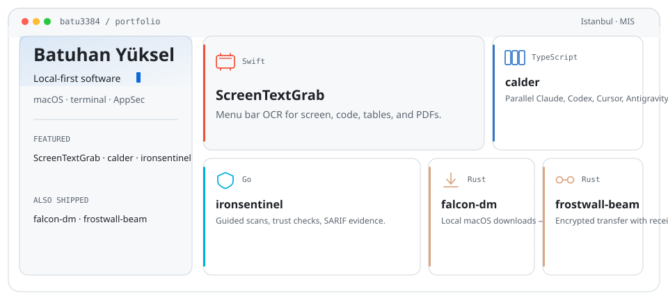

<!-- Generated by scripts/render-profile.mjs. Edit that file, then run: node scripts/render-profile.mjs -->
<picture>
  <source media="(max-width: 700px) and (prefers-color-scheme: dark)" srcset="assets/hero-v8-mobile-dark.svg">
  <source media="(max-width: 700px)" srcset="assets/hero-v8-mobile-light.svg">
  <source media="(prefers-color-scheme: dark)" srcset="assets/hero-v8-dark.svg">
  <source media="(prefers-color-scheme: light)" srcset="assets/hero-v8-light.svg">
  
</picture>

Selected work below — shipped tools that stay on your machine, grouped by where they run.

## Calder workspace

  

Parallel AI coding CLIs in one Electron shell — browser context, telemetry, and governance.

  <picture>
    <source media="(prefers-color-scheme: dark)" srcset="https://skillicons.dev/icons?i=swift%2Cgo%2Cts%2Cpython%2Crust%2Ccpp&theme=dark&perline=6">
    
  </picture>

## Flagship repos

<a href="https://github.com/batu3384/ScreenTextGrab">
  <picture>
    <source media="(prefers-color-scheme: dark)" srcset="https://github-stats-extended.vercel.app/api/pin/?username=batu3384&repo=ScreenTextGrab&hide_border=true&theme=github_dark">
    
  </picture>
</a>

<a href="https://github.com/batu3384/calder">
  <picture>
    <source media="(prefers-color-scheme: dark)" srcset="https://github-stats-extended.vercel.app/api/pin/?username=batu3384&repo=calder&hide_border=true&theme=github_dark">
    
  </picture>
</a>

<a href="https://github.com/batu3384/ironsentinel">
  <picture>
    <source media="(prefers-color-scheme: dark)" srcset="https://github-stats-extended.vercel.app/api/pin/?username=batu3384&repo=ironsentinel&hide_border=true&theme=github_dark">
    
  </picture>
</a>

## Shipped tools

<a href="https://github.com/batu3384/falcon-dm">
  <picture>
    <source media="(prefers-color-scheme: dark)" srcset="https://github-stats-extended.vercel.app/api/pin/?username=batu3384&repo=falcon-dm&hide_border=true&theme=github_dark">
    
  </picture>
</a>

<a href="https://github.com/batu3384/frostwall-beam">
  <picture>
    <source media="(prefers-color-scheme: dark)" srcset="https://github-stats-extended.vercel.app/api/pin/?username=batu3384&repo=frostwall-beam&hide_border=true&theme=github_dark">
    
  </picture>
</a>

<a href="https://github.com/batu3384/sift">
  <picture>
    <source media="(prefers-color-scheme: dark)" srcset="https://github-stats-extended.vercel.app/api/pin/?username=batu3384&repo=sift&hide_border=true&theme=github_dark">
    
  </picture>
</a>

## Selected work

### On the Mac

- **[ScreenTextGrab](https://github.com/batu3384/ScreenTextGrab)** — Local-first macOS menu bar OCR for screen, code, subtitles, tables, and PDFs.
- **[falcon-dm](https://github.com/batu3384/falcon-dm)** — Local-only macOS download manager for HTTP, HLS, and YouTube. No cloud queue.
- **[frostwall-beam](https://github.com/batu3384/frostwall-beam)** — Encrypted LAN and internet file transfer with pairing codes and receiver approval.

### In the terminal

- **[calder](https://github.com/batu3384/calder)** — Terminal-centric Electron workspace for parallel Claude Code, Codex, Cursor, and Antigravity sessions.
- **[sift](https://github.com/batu3384/sift)** — Review-first terminal cleaner for macOS and Windows. Destructive work is previewed before it runs.

### AppSec

- **[ironsentinel](https://github.com/batu3384/ironsentinel)** — Local-first AppSec CLI for guided scans, runtime trust checks, and HTML / SARIF / CSV evidence.
- **[byteback](https://github.com/batu3384/byteback)** — Windows forensic imaging and data recovery with a native C++ engine and an examiner UI.

## Also shipping

- **[byteback](https://github.com/batu3384/byteback)** — Windows forensic imaging and data recovery with a native C++ engine and an examiner UI.
- **[agent-atlas](https://github.com/batu3384/agent-atlas)** — Installer and router that gives AI agents open-web search and research tools.
- **[codebase-audit](https://github.com/batu3384/codebase-audit)** — Evidence-backed whole-repo architecture audit skill for Cursor, Claude Code, Codex, and Antigravity.

## Now building

- **[deskward](https://github.com/batu3384/deskward)** — Tailscale-first remote desktop with a Rust core and Flutter client. Host agents still in phased rollout.
- **[duetto](https://github.com/batu3384/duetto)** — Chrome extension for Udemy: dual captions, translation, lecture notes, and precision playback.

  <picture>
    <source media="(prefers-color-scheme: dark)" srcset="https://raw.githubusercontent.com/batu3384/batu3384/output/github-snake-dark.svg">
    <source media="(prefers-color-scheme: light)" srcset="https://raw.githubusercontent.com/batu3384/batu3384/output/github-snake.svg">
    
  </picture>

GitHub activity

  <picture>
    <source media="(prefers-color-scheme: dark)" srcset="https://github-stats-extended.vercel.app/api?username=batu3384&show_icons=true&hide_border=true&theme=github_dark">
    
  </picture>
  <picture>
    <source media="(prefers-color-scheme: dark)" srcset="https://github-stats-extended.vercel.app/api/top-langs/?username=batu3384&layout=compact&langs_count=6&hide_border=true&theme=github_dark">
    
  </picture>

Profile pins (set in GitHub UI)

Pin these six repos on your profile sidebar: **calder**, **ScreenTextGrab**, **sift**, **ironsentinel**, **falcon-dm**, **frostwall-beam**.

Other public work

- **[hexloom](https://github.com/batu3384/hexloom)** — FastAPI studio for encoding, decoding, and validating structured payloads.
- **[jobcraft](https://github.com/batu3384/jobcraft)** — Local-first job-search workspace for Turkey with Cursor and Claude Code.

Academic projects

- **[vetvision](https://github.com/batu3384/vetvision)** — Desktop AI assistant for dog breed recognition, PDF export, and optional Gemini reports.
- **[fast-express-kds](https://github.com/batu3384/fast-express-kds)** — Cargo operations dashboard with branch analytics, personnel scoring, and forecasting.
- **[sisler-bulvari-cafe-system](https://github.com/batu3384/sisler-bulvari-cafe-system)** — Digital ordering prototype for Sisler Bulvarı Sanat Kafe with menu, orders, and sales views.
- **[autonomous-line-following-robot](https://github.com/batu3384/autonomous-line-following-robot)** — Raspberry Pi line-following robot with ultrasonic obstacle stop, LEDs, and buzzer alerts.

## Contact

[LinkedIn](https://www.linkedin.com/in/batu3384) · [Email](mailto:batu3384@gmail.com)
