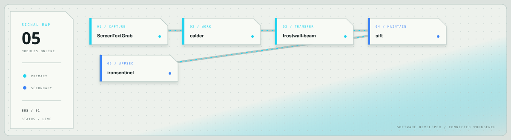

<picture>
  <source media="(prefers-color-scheme: dark)" srcset="assets/hero-dark.svg">
  <source media="(prefers-color-scheme: light)" srcset="assets/hero-light.svg">
  
</picture>

macOS apps · terminal · AppSec · AI tools

## Mission-critical systems

| Repository | Role | Purpose |
| --- | --- | --- |
| [`ScreenTextGrab`](https://github.com/batu3384/ScreenTextGrab) | CAPTURE | Local-first macOS OCR with capture modes for text, code, subtitles, tables, and PDFs\. |
| [`calder`](https://github.com/batu3384/calder) | WORK | Terminal-centric Electron IDE for Claude, Codex, Copilot, Antigravity, and Qwen\. |
| [`sift`](https://github.com/batu3384/sift) | MAINTAIN | Full-screen TUI for cleanup, uninstall, analysis, and permissions review\. |
| [`ironsentinel`](https://github.com/batu3384/ironsentinel) | SECURE | Local-first AppSec CLI with HTML, SARIF, and CSV export for findings review\. |
| [`hexloom`](https://github.com/batu3384/hexloom) | TRANSFORM | Browser workspace and JSON API for structured payload inspection\. |

## Execution deck

<picture>
  <source media="(prefers-color-scheme: dark)" srcset="assets/closed-loop-dark.svg">
  <source media="(prefers-color-scheme: light)" srcset="assets/closed-loop-light.svg">
  
</picture>

## Supporting systems

<strong>Tools and platforms</strong> · 3 modules

| Module | Purpose |
| --- | --- |
| [`agent-atlas`](https://github.com/batu3384/agent-atlas) | Open-web search and research router for AI agents with installer, doctor, and upstream tooling\. |
| [`jobcraft`](https://github.com/batu3384/jobcraft) | AI-powered job search workspace for Turkey with Cursor and Claude Code\. |
| [`frostwall-beam`](https://github.com/batu3384/frostwall-beam) | Encrypted LAN file transfer built with Tauri 2, Rust, and React\. |

<strong>Academic projects</strong> · 4 modules

| Module | Purpose |
| --- | --- |
| [`vetvision`](https://github.com/batu3384/vetvision) | Desktop AI assistant for dog breed recognition with PDF export and optional Gemini reports\. |
| [`fast-express-kds`](https://github.com/batu3384/fast-express-kds) | Decision support dashboard for cargo operations with branch analytics and forecasting\. |
| [`sisler-bulvari-cafe-system`](https://github.com/batu3384/sisler-bulvari-cafe-system) | Digital ordering prototype for Sisler Bulvarı Sanat Kafe with menu, orders, and sales views\. |
| [`autonomous-line-following-robot`](https://github.com/batu3384/autonomous-line-following-robot) | Raspberry Pi line-following robot with obstacle stopping, LED, and buzzer alerts\. |

<a href="https://www.linkedin.com/in/batu3384">LinkedIn</a> · <a href="mailto:batu3384@gmail.com">Email</a>

<!-- Generated by profile-control-plane. Edit profile.yaml, not this file. -->
