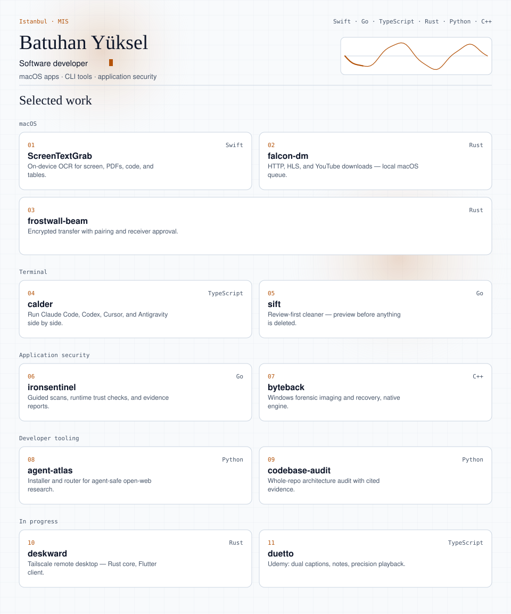

<!-- Generated by scripts/render-profile.mjs. Edit that file, then run: node scripts/render-profile.mjs -->
<picture>
  <source media="(max-width: 700px) and (prefers-color-scheme: dark)" srcset="assets/board-v13-mobile-dark.svg">
  <source media="(max-width: 700px)" srcset="assets/board-v13-mobile-light.svg">
  <source media="(prefers-color-scheme: dark)" srcset="assets/board-v13-dark.svg">
  <source media="(prefers-color-scheme: light)" srcset="assets/board-v13-light.svg">
  
</picture>

MIS graduate in Istanbul. I ship local-first software: macOS apps, CLI tools, and security workflows that keep data and reports on the machine.

## Selected work

### macOS

**01 · [ScreenTextGrab](https://github.com/batu3384/ScreenTextGrab)** · Swift  
Menu-bar OCR with Apple Vision. Screen regions, PDFs, code, tables, and subtitles stay on the device.

**02 · [falcon-dm](https://github.com/batu3384/falcon-dm)** · Rust  
macOS download manager for HTTP, HLS, and YouTube, with browser capture. Tauri and Rust. No cloud queue.

**03 · [frostwall-beam](https://github.com/batu3384/frostwall-beam)** · Rust  
Encrypted file transfer on a LAN or across the internet. Pairing codes, receiver approval, no cloud account.

### Terminal & CLI

**04 · [calder](https://github.com/batu3384/calder)** · TypeScript  
Electron workspace for parallel Claude Code, Codex, Cursor, and Antigravity sessions, with telemetry and governance in one shell.

**05 · [sift](https://github.com/batu3384/sift)** · Go  
Review-first terminal cleaner for macOS and Windows. Typed Go core; a preview step sits in front of destructive work.

### Application security

**06 · [ironsentinel](https://github.com/batu3384/ironsentinel)** · Go  
AppSec CLI and TUI for guided scans, runtime trust checks, and HTML, SARIF, and CSV evidence exports. Local-first.

**07 · [byteback](https://github.com/batu3384/byteback)** · C++  
Windows forensic imaging and file recovery. Native engine with an examiner UI.

### Developer tooling

**08 · [agent-atlas](https://github.com/batu3384/agent-atlas)** · Python  
Installer and router that gives coding agents controlled open-web search and research tools.

**09 · [codebase-audit](https://github.com/batu3384/codebase-audit)** · Python  
Whole-repo architecture audit for Cursor, Claude Code, Codex, and Antigravity. Findings come with citations.

### In progress

**10 · [deskward](https://github.com/batu3384/deskward)** · Rust  
Tailscale remote desktop with a Rust core and a Flutter client. Host agents are still rolling out.

**11 · [duetto](https://github.com/batu3384/duetto)** · TypeScript  
Chrome extension for Udemy: dual captions, translation, notes, and precise playback controls.

Other public repositories

- **[hexloom](https://github.com/batu3384/hexloom)** — FastAPI studio to encode, decode, and validate structured payloads.
- **[jobcraft](https://github.com/batu3384/jobcraft)** — Local job-search workspace for Turkey, built for Cursor and Claude Code.

Academic work

- **[vetvision](https://github.com/batu3384/vetvision)** — Desktop app for dog-breed recognition, PDF export, and optional Gemini reports.
- **[fast-express-kds](https://github.com/batu3384/fast-express-kds)** — Cargo operations dashboard with branch analytics, personnel scoring, and forecasting.
- **[sisler-bulvari-cafe-system](https://github.com/batu3384/sisler-bulvari-cafe-system)** — Digital ordering prototype for Sisler Bulvarı Sanat Kafe.
- **[autonomous-line-following-robot](https://github.com/batu3384/autonomous-line-following-robot)** — Raspberry Pi line-following robot that stops on obstacles, with LED and buzzer alerts.

Activity

  <picture>
    <source media="(prefers-color-scheme: dark)" srcset="https://raw.githubusercontent.com/batu3384/batu3384/output/github-snake-dark.svg">
    <source media="(prefers-color-scheme: light)" srcset="https://raw.githubusercontent.com/batu3384/batu3384/output/github-snake.svg">
    
  </picture>

  <picture>
    <source media="(prefers-color-scheme: dark)" srcset="https://github-stats-extended.vercel.app/api?username=batu3384&show_icons=true&hide_border=true&theme=github_dark">
    
  </picture>
  <picture>
    <source media="(prefers-color-scheme: dark)" srcset="https://github-stats-extended.vercel.app/api/top-langs/?username=batu3384&layout=compact&langs_count=6&hide_border=true&theme=github_dark">
    
  </picture>

## Contact

[LinkedIn](https://www.linkedin.com/in/batu3384) · [Email](mailto:batu3384@gmail.com)
