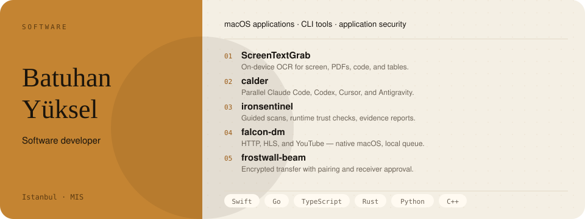
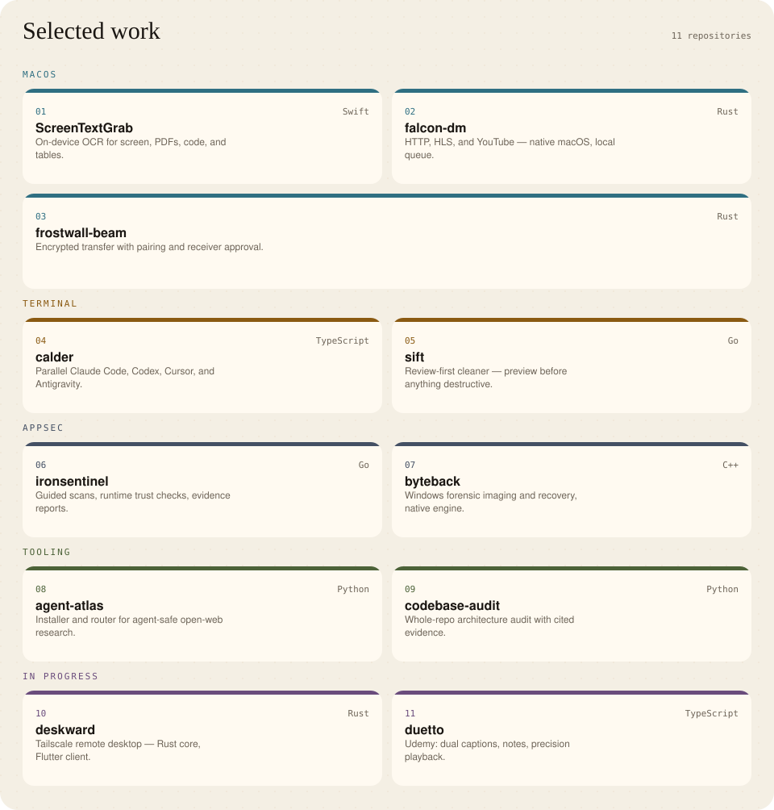

<!-- Generated by scripts/render-profile.mjs. Edit that file, then run: node scripts/render-profile.mjs -->
<picture>
  <source media="(max-width: 700px) and (prefers-color-scheme: dark)" srcset="assets/hero-v10-mobile-dark.svg">
  <source media="(max-width: 700px)" srcset="assets/hero-v10-mobile-light.svg">
  <source media="(prefers-color-scheme: dark)" srcset="assets/hero-v10-dark.svg">
  <source media="(prefers-color-scheme: light)" srcset="assets/hero-v10-light.svg">
  
</picture>

MIS graduate in Istanbul. I design and ship local-first software: macOS utilities, terminal tools, and security workflows with evidence you can inspect.

<picture>
  <source media="(max-width: 700px) and (prefers-color-scheme: dark)" srcset="assets/work-v10-mobile-dark.svg">
  <source media="(max-width: 700px)" srcset="assets/work-v10-mobile-light.svg">
  <source media="(prefers-color-scheme: dark)" srcset="assets/work-v10-dark.svg">
  <source media="(prefers-color-scheme: light)" srcset="assets/work-v10-light.svg">
  
</picture>

## Selected work

### macOS

<table width="100%">
<tr><td valign="top" width="50%">
<h3>01 · <a href="https://github.com/batu3384/ScreenTextGrab">ScreenTextGrab</a></h3>

Swift 
Local-first menu bar OCR with Apple Vision — screen regions, PDFs, code, tables, and subtitles stay on device.

</td><td valign="top" width="50%">
<h3>02 · <a href="https://github.com/batu3384/falcon-dm">falcon-dm</a></h3>

Rust 
macOS download manager with multi-thread HTTP, HLS, YouTube, and browser capture — Tauri/Rust, no cloud queue.

</td></tr>
<tr><td valign="top" width="50%">
<h3>03 · <a href="https://github.com/batu3384/frostwall-beam">frostwall-beam</a></h3>

Rust 
Cross-platform encrypted file transfer on LAN or the internet — pairing codes, receiver approval, no cloud account.

</td><td width="50%"></td></tr>
</table>

### Terminal & CLI

<table width="100%">
<tr><td valign="top" width="50%">
<h3>04 · <a href="https://github.com/batu3384/calder">calder</a></h3>

TypeScript 
Electron workspace for parallel Claude Code, Codex, Cursor, and Antigravity CLI sessions with telemetry and governance in one shell.

</td><td valign="top" width="50%">
<h3>05 · <a href="https://github.com/batu3384/sift">sift</a></h3>

Go 
Review-first terminal cleaner for macOS and Windows — typed Go core, preview step before destructive work.

</td></tr>
</table>

### Application security

<table width="100%">
<tr><td valign="top" width="50%">
<h3>06 · <a href="https://github.com/batu3384/ironsentinel">ironsentinel</a></h3>

Go 
Local-first AppSec CLI and TUI for guided scans, runtime trust checks, and HTML / SARIF / CSV evidence exports.

</td><td valign="top" width="50%">
<h3>07 · <a href="https://github.com/batu3384/byteback">byteback</a></h3>

C++ 
Windows forensic imaging and file recovery with a native engine and an examiner-facing UI.

</td></tr>
</table>

### Developer tooling

<table width="100%">
<tr><td valign="top" width="50%">
<h3>08 · <a href="https://github.com/batu3384/agent-atlas">agent-atlas</a></h3>

Python 
Installer and router that gives AI agents controlled open-web search and research tools.

</td><td valign="top" width="50%">
<h3>09 · <a href="https://github.com/batu3384/codebase-audit">codebase-audit</a></h3>

Python 
Whole-repo architecture audit skill for Cursor, Claude Code, Codex, and Antigravity with cited evidence.

</td></tr>
</table>

### In progress

<table width="100%">
<tr><td valign="top" width="50%">
<h3>10 · <a href="https://github.com/batu3384/deskward">deskward</a></h3>

Rust 
Tailscale-first remote desktop platform with a Rust core and Flutter client; host agents in phased rollout.

</td><td valign="top" width="50%">
<h3>11 · <a href="https://github.com/batu3384/duetto">duetto</a></h3>

TypeScript 
Chrome extension for Udemy with dual captions, translation, notes, and precision playback controls.

</td></tr>
</table>

Other public repositories

- **[hexloom](https://github.com/batu3384/hexloom)** — FastAPI studio for encoding, decoding, and validating structured payloads.
- **[jobcraft](https://github.com/batu3384/jobcraft)** — Local-first job-search workspace for Turkey with Cursor and Claude Code.

Academic work

- **[vetvision](https://github.com/batu3384/vetvision)** — Desktop assistant for dog breed recognition, PDF export, and optional Gemini-backed reports.
- **[fast-express-kds](https://github.com/batu3384/fast-express-kds)** — Cargo operations dashboard with branch analytics, personnel scoring, and forecasting.
- **[sisler-bulvari-cafe-system](https://github.com/batu3384/sisler-bulvari-cafe-system)** — Digital ordering prototype for Sisler Bulvarı Sanat Kafe.
- **[autonomous-line-following-robot](https://github.com/batu3384/autonomous-line-following-robot)** — Raspberry Pi line-following robot with obstacle stop, LEDs, and buzzer alerts.

Activity

  <picture>
    <source media="(prefers-color-scheme: dark)" srcset="https://raw.githubusercontent.com/batu3384/batu3384/output/github-snake-dark.svg">
    <source media="(prefers-color-scheme: light)" srcset="https://raw.githubusercontent.com/batu3384/batu3384/output/github-snake.svg">
    
  </picture>

  <picture>
    <source media="(prefers-color-scheme: dark)" srcset="https://github-stats-extended.vercel.app/api?username=batu3384&show_icons=true&hide_border=true&theme=github_dark">
    
  </picture>
  <picture>
    <source media="(prefers-color-scheme: dark)" srcset="https://github-stats-extended.vercel.app/api/top-langs/?username=batu3384&layout=compact&langs_count=6&hide_border=true&theme=github_dark">
    
  </picture>

## Contact

[LinkedIn](https://www.linkedin.com/in/batu3384) · [Email](mailto:batu3384@gmail.com)
