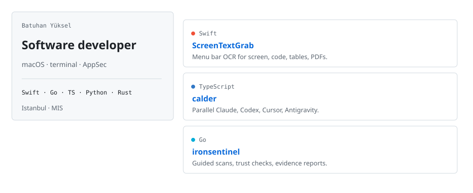
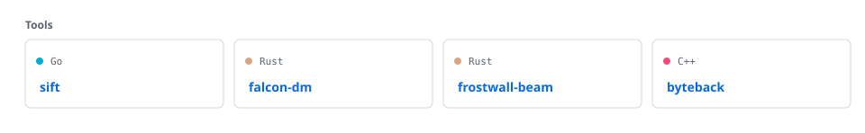

<!-- Generated by scripts/render-profile.mjs. Edit that file, then run: node scripts/render-profile.mjs -->
<picture>
  <source media="(max-width: 700px) and (prefers-color-scheme: dark)" srcset="assets/hero-v6-mobile-dark.svg">
  <source media="(max-width: 700px)" srcset="assets/hero-v6-mobile-light.svg">
  <source media="(prefers-color-scheme: dark)" srcset="assets/hero-v6-dark.svg">
  <source media="(prefers-color-scheme: light)" srcset="assets/hero-v6-light.svg">
  
</picture>

MIS graduate in Istanbul. I build local-first macOS apps, terminal tools, and AppSec workflows in Swift, Go, TypeScript, Python, and Rust.

## Selected work

**[ScreenTextGrab](https://github.com/batu3384/ScreenTextGrab)** — Swift. Local-first macOS menu bar OCR for screen, code, subtitles, tables, and PDFs.

**[calder](https://github.com/batu3384/calder)** — TypeScript. Terminal-centric Electron workspace for parallel Claude Code, Codex, Cursor, and Antigravity sessions.

**[ironsentinel](https://github.com/batu3384/ironsentinel)** — Go. Local-first AppSec CLI for guided scans, runtime trust checks, and HTML / SARIF / CSV evidence.

<picture>
  <source media="(max-width: 700px) and (prefers-color-scheme: dark)" srcset="assets/index-v6-mobile-dark.svg">
  <source media="(max-width: 700px)" srcset="assets/index-v6-mobile-light.svg">
  <source media="(prefers-color-scheme: dark)" srcset="assets/index-v6-dark.svg">
  <source media="(prefers-color-scheme: light)" srcset="assets/index-v6-light.svg">
  
</picture>

## Tools

- **[sift](https://github.com/batu3384/sift)** — Review-first terminal cleaner for macOS and Windows. Destructive work is previewed before it runs.
- **[falcon-dm](https://github.com/batu3384/falcon-dm)** — Local-only macOS download manager for HTTP, HLS, and YouTube. No cloud queue.
- **[frostwall-beam](https://github.com/batu3384/frostwall-beam)** — Encrypted LAN and internet file transfer with pairing codes and receiver approval.
- **[byteback](https://github.com/batu3384/byteback)** — Windows forensic imaging and data recovery with a native C++ engine and an examiner UI.

## Also shipping

- **[agent-atlas](https://github.com/batu3384/agent-atlas)** — Installer and router that gives AI agents open-web search and research tools.
- **[codebase-audit](https://github.com/batu3384/codebase-audit)** — Evidence-backed whole-repo architecture audit skill for Cursor, Claude Code, Codex, and Antigravity.
- **[deskward](https://github.com/batu3384/deskward)** — Tailscale-first remote desktop with a Rust core and Flutter client. Still in phased host-agent work.
- **[duetto](https://github.com/batu3384/duetto)** — Chrome extension for Udemy: dual captions, translation, lecture notes, and precision playback.

Other public work

- **[hexloom](https://github.com/batu3384/hexloom)** — FastAPI studio for encoding, decoding, and validating structured payloads.
- **[jobcraft](https://github.com/batu3384/jobcraft)** — Local-first job-search workspace for Turkey with Cursor and Claude Code.

Academic projects

- **[vetvision](https://github.com/batu3384/vetvision)** — Desktop AI assistant for dog breed recognition, PDF export, and optional Gemini reports.
- **[fast-express-kds](https://github.com/batu3384/fast-express-kds)** — Cargo operations dashboard with branch analytics, personnel scoring, and forecasting.
- **[sisler-bulvari-cafe-system](https://github.com/batu3384/sisler-bulvari-cafe-system)** — Digital ordering prototype for Sisler Bulvarı Sanat Kafe with menu, orders, and sales views.
- **[autonomous-line-following-robot](https://github.com/batu3384/autonomous-line-following-robot)** — Raspberry Pi line-following robot with ultrasonic obstacle stop, LEDs, and buzzer alerts.

## Contact

[LinkedIn](https://www.linkedin.com/in/batu3384) · [Email](mailto:batu3384@gmail.com)
